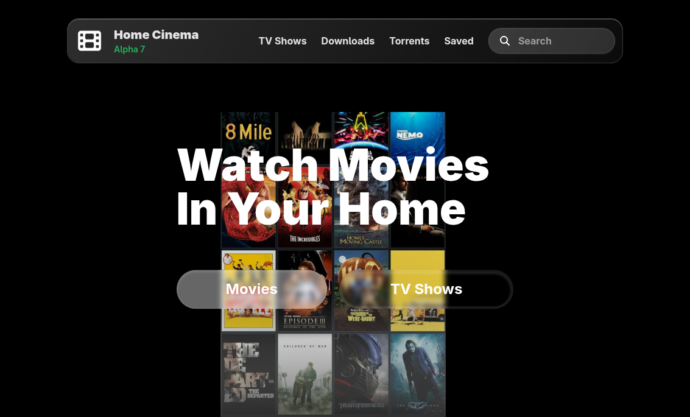

# HomeCinema Desktop

Torrent streaming desktop app via HTTP protocol using [torrent-streamer-api](https://github.com/KHLALA-Gh/torrent-streamer-api) for the backend and [Home Cinema App](https://github.com/KHLALA-Gh/HomeCinemaWebsite) as the app UI.



## Installation :

Go to [releases](https://github.com/KHLALA-Gh/HomeCinema-Desktop/releases) then click on the download link under "Assets" (.exe for Windows and .AppImage for Linux).

## Run from source code

### Required packages :

- [Node.js](https://nodejs.org/) >= v22

Create your free TMDB Api key from [TMDB subscription](https://www.themoviedb.org/subscription) (login to your account or create one).

Then create a new file in the root directory and name it `.env` then past your Api key in the new file like this (replace \<your api key> with your api key) :

```.env
TMDB_KEY=<your api key>
```

- Install packages :

```bash
npm i
```

- Run the app :

```
npm start
```

## Build from source code

make sure you install the npm packages

```bash
npm i
```

Build typescript

```bash
npm run build:ts
```

Rebuild native modules

```bash
npx electron-builder install-app-deps
```

### Build Windows NSIS

```bash
npx electron-builder --win nsis
```

### Build Linux AppImage

```bash
npx electron-builder --linux AppImage
```

After building you will find your binary file in `./build/HomeCinema-<app version>.(AppImage or .exe)`
